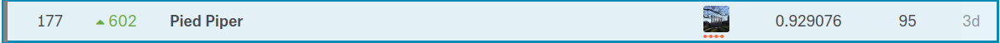

# IEEE-CIS Fraud Detection

This is the repository for the Kaggle competition: 

<https://www.kaggle.com/c/ieee-fraud-detection/overview>

I got 177th out of 6381 teams (top 3%)

The model I used is:
light gbm

